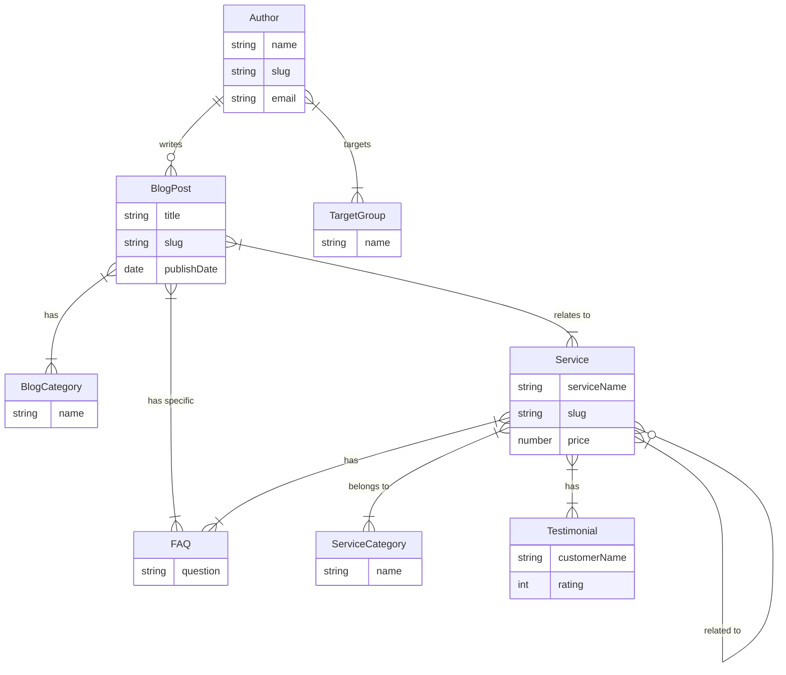

# Documentazione per il Content Manager

Questa documentazione descrive l'attuale Content Model in Contentful. Serve come riferimento per la gestione e la creazione dei contenuti.

## Indice
1. [Panoramica dei Content Types](#1-panoramica-dei-content-types)
2. [Tipi di Campo & Regole di Validazione](#2-tipi-di-campo--regole-di-validazione)
3. [Diagramma delle Relazioni tra Entità (ERD)](#3-diagramma-delle-relazioni-tra-entità-erd)

---

## 1. Panoramica dei Content Types

### Author (Autore)
*ID: `author`*
*Descrizione: Autori degli articoli del blog*

| Nome Campo (Fieldname) | Field ID | Tipo (Fieldtype) | Validazione / Limitazioni | Descrizione |
| :--- | :--- | :--- | :--- | :--- |
| Name | `name` | Symbol | Required | Nome dell'autore |
| Slogan | `slogan` | Symbol | - | Breve slogan o titolo |
| Slug | `slug` | Symbol | Required, Unique | Identificatore URL-friendly |
| Profile Image | `profileImage` | Link (Asset) | - | Immagine del profilo dell'autore |
| Titel/Position | `jobTitle` | Symbol | - | Qualifica o Posizione lavorativa |
| Biography | `bio` | RichText | Required | Biografia dettagliata. Permette titoli, liste, citazioni, link. |
| Target Groups | `targetGroups` | Array (Entries) | Required, Link a `Target Group` | Gruppi target a cui l'autore si rivolge |
| Promise | `promise` | Text | Localized, Max 600 caratteri | La promessa dell'autore ai clienti |
| Email | `email` | Symbol | Regex (Formato Email) | Email di contatto |
| Phone | `phone` | Symbol | - | Numero di telefono |
| Social Links | `socialLinks` | Object | - | Oggetto JSON per i link ai Social Media |
| Booking Link | `bookingLink` | Symbol | Regex (Formato URL) | Link per la prenotazione di appuntamenti |

### Blog Category (Categoria Blog)
*ID: `category`*
*Descrizione: Categorie del blog*

| Nome Campo (Fieldname) | Field ID | Tipo (Fieldtype) | Validazione / Limitazioni | Descrizione |
| :--- | :--- | :--- | :--- | :--- |
| Name | `name` | Symbol | Required, Unique | Nome della categoria |
| Slug | `slug` | Symbol | Required, Unique | Identificatore URL-friendly |
| Description | `description` | Text | - | Breve descrizione della categoria |
| Color | `color` | Symbol | Regex (Codice Colore Hex) | Colore per elementi UI (es. etichette) |

### Service Category (Categoria Servizio)
*ID: `serviceCategory`*
*Descrizione: Categorie dei servizi*

| Nome Campo (Fieldname) | Field ID | Tipo (Fieldtype) | Validazione / Limitazioni | Descrizione |
| :--- | :--- | :--- | :--- | :--- |
| Name | `name` | Symbol | Required, Unique | Nome della categoria del servizio |
| Slug | `slug` | Symbol | Required, Unique | Identificatore URL-friendly |
| Description | `description` | Text | - | Descrizione della categoria |
| Color | `color` | Symbol | Regex (Codice Colore Hex) | Colore per contrassegno |
| Icon | `icon` | Symbol | - | Nome Icona o Identificatore |

### FAQ (Domande Frequenti)
*ID: `faq`*
*Descrizione: Domande frequenti*

| Nome Campo (Fieldname) | Field ID | Tipo (Fieldtype) | Validazione / Limitazioni | Descrizione |
| :--- | :--- | :--- | :--- | :--- |
| Question | `question` | Symbol | Required | La domanda |
| Answer | `answer` | RichText | Required | La risposta (formattata) |
| Category | `category` | Symbol | - | Categorizzazione opzionale |
| Order | `order` | Integer | - | Ordine di visualizzazione |

### Testimonial (Recensioni Clienti)
*ID: `testimonial`*
*Descrizione: Recensioni dei clienti*

| Nome Campo (Fieldname) | Field ID | Tipo (Fieldtype) | Validazione / Limitazioni | Descrizione |
| :--- | :--- | :--- | :--- | :--- |
| Kundenname | `customerName` | Symbol | Required | Nome del cliente |
| Bewertung | `rating` | Integer | Required, Range 1-5 | Valutazione in stelle |
| Testimonial Text | `testimonialText` | Text | Required | Il testo della recensione |
| Datum | `date` | Date | - | Data della recensione |
| Foto | `customerPhoto` | Link (Asset) | - | Foto del cliente |
| Featured | `isFeatured` | Boolean | Default: false | Recensione in evidenza? |

### Service (Servizio)
*ID: `service`*
*Descrizione: Servizi e Trattamenti*

| Nome Campo (Fieldname) | Field ID | Tipo (Fieldtype) | Validazione / Limitazioni | Descrizione |
| :--- | :--- | :--- | :--- | :--- |
| Hero Image | `heroImage` | Link (Asset) | Required | Immagine principale per la pagina del servizio |
| Service Name | `serviceName` | Symbol | Required, Unique | Nome del servizio |
| Slug | `slug` | Symbol | Required, Unique, Regex | Percorso URL (solo lettere minuscole, numeri, trattini) |
| Meta Description | `metaDescription` | Symbol | Max 160 caratteri | Descrizione SEO |
| Detailed Description | `detailedDescription` | RichText | Required | Descrizione dettagliata del servizio |
| Category | `serviceCategory` | Array (Entries) | Link a `Service Category` | Categorie del servizio |
| Icon | `icon` | Symbol | - | Identificatore dell'icona |
| How Does It Work? | `howDoesItWork` | RichText | Required | Spiegazione del processo |
| Benefits | `benefits` | RichText | Required | Vantaggi del trattamento |
| Who is it for? | `whoIsItFor` | RichText | Required | Destinatari (Target group) |
| Contraindications | `contraindications` | RichText | - | Controindicazioni / Quando non è adatto |
| Treatment Process | `treatmentProcess` | RichText | - | Svolgimento dettagliato |
| Treatment Duration | `duration` | Symbol | Required | Durata (es. "60 min") |
| Price | `price` | Number | - | Prezzo in Euro |
| Price Description | `priceDescription` | Symbol | - | Aggiunta al prezzo (es. "a partire da") |
| Booking Link | `bookingLink` | Symbol | Regex (URL) | Link di prenotazione specifico |
| Gallery | `gallery` | Array (Assets) | - | Galleria immagini |
| Testimonials | `testimonials` | Array (Entries) | Link a `Testimonial` | Recensioni collegate |
| FAQs | `faqs` | Array (Entries) | Link a `FAQ` | Domande specifiche sul servizio |
| Related Services | `relatedServices` | Array (Entries) | Link a `Service` | Servizi simili |
| Featured | `isFeatured` | Boolean | Default: false | Mettere in evidenza sulla Home? |
| Order | `order` | Integer | - | Ordinamento |
| Status | `status` | Symbol | Required, In ["Active", "Inactive"] | Stato del servizio |

### Blog Post (Articolo)
*ID: `blogPost`*
*Descrizione: Articoli del Blog*

| Nome Campo (Fieldname) | Field ID | Tipo (Fieldtype) | Validazione / Limitazioni | Descrizione |
| :--- | :--- | :--- | :--- | :--- |
| Title | `title` | Symbol | Required, Unique | Titolo dell'articolo |
| Slug | `slug` | Symbol | Required, Unique, Regex | Percorso URL |
| Meta Description | `metaDescription` | Symbol | Max 160 caratteri | Descrizione SEO |
| Featured Image | `featuredImage` | Link (Asset) | Required | Immagine di anteprima |
| Author | `author` | Link (Entry) | Required, Link a `Author` | Autore dell'articolo |
| Publish Date | `publishDate` | Date | Required | Data di pubblicazione |
| Category | `category` | Array (Entries) | Link a `Blog Category` | Categorie |
| Tags | `tags` | Array (Symbols) | - | Tag / Parole chiave |
| Introduction | `excerpt` | Text | Required, Max 300 caratteri | Introduzione / Teaser |
| Content | `content` | RichText | Required | Il contenuto principale dell'articolo |
| Reading Time | `readingTime` | Integer | - | Tempo di lettura in minuti |
| Related Services | `relatedServices` | Array (Entries) | Link a `Service` | Servizi correlati al tema |
| FAQ Section | `faqSection` | Array (Entries) | Link a `FAQ` | FAQ pertinenti |
| Featured | `isFeatured` | Boolean | Default: false | Articolo in evidenza? |
| Status | `status` | Symbol | Required, In ["Draft", "Published", "Archived"] | Stato della pubblicazione |

### Page Settings (Impostazioni Pagina)
*ID: `pageSettings`*
*Descrizione: Impostazioni per le diverse Pagine*

| Nome Campo (Fieldname) | Field ID | Tipo (Fieldtype) | Validazione / Limitazioni | Descrizione |
| :--- | :--- | :--- | :--- | :--- |
| Page Name | `pageName` | Symbol | Required, Unique | Nome interno della pagina |
| Hero Title | `heroTitle` | Symbol | - | Titolo nella sezione Hero |
| Hero Subtitle | `heroSubtitle` | Text | - | Sottotitolo nella sezione Hero |
| Hero Image | `heroImage` | Link (Asset) | - | Immagine di sfondo Hero |
| CTA Text | `ctaText` | Symbol | - | Testo del bottone Call-to-Action |
| CTA Link | `ctaLink` | Symbol | - | Link del bottone Call-to-Action |
| SEO Title | `seoTitle` | Symbol | - | Meta Title della pagina |
| SEO Description | `seoDescription` | Text | - | Meta Description della pagina |

### Promo Banner
*ID: `promoBanner`*
*Descrizione: Banner per Offerte Promozionali*

| Nome Campo (Fieldname) | Field ID | Tipo (Fieldtype) | Validazione / Limitazioni | Descrizione |
| :--- | :--- | :--- | :--- | :--- |
| Title | `title` | Symbol | Required | Titolo della promozione |
| Message | `message` | Text | Required | Testo promozionale |
| Background Color | `backgroundColor` | Symbol | Regex (Colore Hex) | Colore di sfondo |
| Link | `link` | Symbol | - | Link di destinazione al click |
| Is Active | `isActive` | Boolean | Default: false | Attivare il banner? |
| Start Date | `startDate` | Date | - | Data di inizio |
| End Date | `endDate` | Date | - | Data di fine |

### Target Group (Gruppo Target)
*ID: `targetGroup`*
*Descrizione: Pubblico di destinazione*

| Nome Campo (Fieldname) | Field ID | Tipo (Fieldtype) | Validazione / Limitazioni | Descrizione |
| :--- | :--- | :--- | :--- | :--- |
| Name | `name` | Symbol | Required, Unique | Nome del gruppo target |
| Targeting Method | `targetingMethod` | Symbol | Required | Metodo di targeting |

---

## 2. Tipi di Campo & Regole di Validazione

| Tipo / Regola | Descrizione |
| :--- | :--- |
| **Symbol** | Testo breve (Stringa), max. 256 caratteri. Adatto per titoli, nomi, slug. |
| **Text** | Testo lungo, multilinea. Adatto per descrizioni, teaser. |
| **RichText** | Testo formattabile. Permette grassetto, liste, titoli, link e l'incorporamento di media. |
| **Integer / Number** | Numeri interi o decimali. |
| **Boolean** | Interruttore Vero/Falso (Sì/No). |
| **Date** | Data e opzionalmente orario. |
| **Link (Asset)** | Riferimento a un file multimediale (Immagine, PDF, ecc.) in Contentful. |
| **Link (Entry)** | Riferimento a un altro elemento di contenuto (es. Autore collegato a un Post del Blog). |
| **Region / Object** | Memorizza dati JSON. |
| **Required** | Il campo deve essere compilato, altrimenti l'elemento non può essere pubblicato. |
| **Unique** | Il valore in questo campo deve essere unico nell'intero Space per questo Content Type. |
| **Regex** | Il valore deve corrispondere a un determinato pattern (es. formato Email, URL, Colore Hex). |
| **Size / Range** | Limita il numero di caratteri (per il testo) o la grandezza del valore (per i numeri). |

---

## 3. Diagramma delle Relazioni tra Entità (ERD)

Il seguente diagramma mostra le relazioni tra i diversi Content Types:

